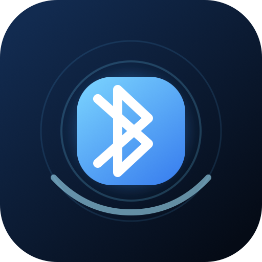

<p align="center">
  
</p>

<h1 align="center">AudioBridge — GUI</h1>

<p align="center">
  <strong>Выберите, где должна звучать ваша PS5</strong><br>
  Передача звука PS5 на совместимое Bluetooth-аудиоустройство без USB-донгла.
</p>

| | |
|---|---|
| **Основа** | [FGG-PlayPods](https://github.com/FGGstore/FGG-PlayPods) от [FathiGhanem](https://github.com/FathiGhanem) |
| **Транспорт** | Classic Bluetooth A2DP sink с обязательным codec SBC |
| **Устройства** | наушники, гарнитуры в режиме A2DP, колонки, саундбары, ресиверы и адаптеры |
| **Управление** | встроенный RU/EN Web GUI и additive JSON API |
| **Запуск** | один payload через elfldr, обычно порт `9021` |
| **Версия** | `0.3.0` |

AudioBridge — самостоятельное продолжение и производная работа на базе FGG-PlayPods. Проверенная реализация захвата звука, Bluetooth, AVDTP, A2DP и SBC сохранена. Проект добавляет асинхронный backend, выбор устройства, HTTP API, Web GUI, измеримую диагностику задержки и собственную постоянную плитку PS5.

## Происхождение и атрибуция

[FathiGhanem](https://github.com/FathiGhanem) реализовал в [FGG-PlayPods](https://github.com/FGGstore/FGG-PlayPods) наиболее сложную основу: захват звука PS5, работу общего Bluetooth-контроллера без отключения DualSense, pairing/SSP, HCI, L2CAP, SDP, AVDTP, SBC и A2DP source. AudioBridge сохраняет происхождение, историю и лицензию этой работы.

Installer плитки основан на проверенном `sceAppInstUtil` подходе официального [ps5-payload-dev/tv4play](https://github.com/ps5-payload-dev/tv4play). Прямой `deeplinkUri` соответствует launcher metadata официального [ps5-payload-dev/websrv](https://github.com/ps5-payload-dev/websrv). Vendored SBC codec происходит из BlueZ.

## Архитектура

```text
elfldr :9021 ── запускает audiobridge-gui.elf
                         │
                         ├─ устанавливает/обновляет плитку ABRG18195
                         ├─ Bluetooth/A2DP backend worker
                         └─ HTTP server 0.0.0.0:18195
                                      │
        PS5 tile ── http://127.0.0.1:18195/
 external browser ── http://<IP-PS5>:18195/
                                      │
                         Web GUI / JSON API
                                      │
                    capture ── SBC ── RTP/A2DP ── audio device
```

Основной payload не требует Homebrew Launcher и не запускается через `websrv/hbldr`. После перезагрузки плитка остаётся, но долгоживущий backend нужно снова отправить через elfldr. Плитка — Web/Media shortcut, а не автозапуск payload.

## Нативная плитка PS5

Параметры плитки находятся в `tile/sce_sys/param.json`:

- Title ID: `ABRG18195` (формат 4 заглавные буквы + 5 цифр);
- `applicationCategoryType`: `65536` (Media app);
- `deeplinkUri`: `http://127.0.0.1:18195/`;
- отображаемое имя: `AudioBridge`.

Поиск GitHub на момент выбора ID не нашёл другого `ABRG18195`, однако централизованного реестра homebrew Title ID нет. Installer дополнительно проверяет `/user/app/ABRG18195` и `/user/appmeta/ABRG18195`: существующая запись без ownership marker AudioBridge считается коллизией и никогда не перезаписывается.

При первом запуске payload записывает только:

```text
/user/app/ABRG18195/
├── audiobridge-owner.txt
└── sce_sys/
    ├── param.json
    └── icon0.png
```

Регистрация выполняется через `sceAppInstUtilAppInstallTitleDir`, с тем же fallback на `sceAppInstUtilAppInstallAll`, который использует upstream. Обновление атомарно заменяет только собственные файлы и повторно регистрирует title без предварительного удаления. Отдельный `audiobridge-uninstall.elf` вызывает `sceAppInstUtilAppUnInstall` только после проверки ownership marker и затем удаляет только точные известные пути. Каталог данных и pairing keys не удаляются.

### Почему не `webAppUri` из tv4play

`tv4play` использует Web Based Media App (`66048`) и `webAppUri`, который через короткий URL перенаправляет на `localhost:8080/fs/...`; статические файлы обслуживает `websrv`. AudioBridge должен работать без `websrv`, поэтому использует прямой `deeplinkUri` на собственный HTTP server — подход, применяемый launcher metadata самого `websrv` и другими self-hosted payload UI.

### Ограничение состояния ожидания

Когда HTTP server уже поднялся, страница сразу открывается и показывает `starting`, `ready` или понятное ожидание backend. Если payload вообще не запущен, на `127.0.0.1:18195` некому отдать HTML: WebKit показывает собственную ошибку соединения. Плитка не может самостоятельно запустить payload после reboot. Формулировка и скорость системной ошибки, положение плитки и обновление metadata зависят от firmware и требуют теста на реальной PS5; бесконечный запуск `hbldr` в этой архитектуре не используется.

## Профили задержки

Рабочая Bluetooth/A2DP реализация и bitpool по умолчанию (`max 53`, ограниченный возможностями sink) не изменены.

| Профиль | RTP packetization | Максимальная очередь | После trim | Назначение |
|---|---:|---:|---:|---|
| Stable | максимально допустимое число SBC frames | 250 ms | 80 ms | прежнее безопасное поведение |
| Low latency | не более 2 SBC frames | 80 ms | 24 ms | меньше программной packet/queue задержки |

Профиль сохраняется в `/data/fgg-playpods-gui/audio-profile.txt` и применяется к следующему stream. Во время подключения или streaming изменение отклоняется, чтобы не перестраивать активный AVDTP поток. Low latency может увеличить чувствительность к radio stalls; он не устраняет аппаратный буфер Bluetooth-аудиоустройства.

Каждые 250 ms для API обновляются:

- текущая и максимальная PCM queue в миллисекундах;
- длительность RTP-пакета и SBC frames per packet;
- sample rate и bitpool;
- packet/capture record counters;
- trimmed PCM frames, capture overruns и capture restarts.

Каждые 5 секунд те же ключевые значения записываются в лог.

## Web API

Backend слушает все IPv4-интерфейсы на порту `18195`. Длительные операции выполняются worker-потоком, поэтому HTTP не блокируется во время scan, pairing, connect или streaming. Существующие endpoints сохранены; новые поля и endpoint профиля добавлены без удаления старых.

| Метод | Endpoint | Назначение |
|---|---|---|
| `GET` | `/api/status` | состояние controller/stream, `audioProfile` и `latency` metrics |
| `GET` | `/api/devices` | найденные Bluetooth-аудиоустройства |
| `POST` | `/api/scan` | поставить discovery в очередь |
| `POST` | `/api/connect` | подключить устройство; `{"mac":"AA:BB:CC:DD:EE:FF"}` |
| `POST` | `/api/disconnect` | остановить stream и отключить устройство |
| `GET` | `/api/saved` | устройство с сохранённым link key |
| `GET` | `/api/audio-profile` | текущий профиль и допустимые значения |
| `POST` | `/api/audio-profile` | `{"profile":"stable"}` или `{"profile":"low_latency"}` |

Команды scan/connect/disconnect принимаются с `202 Accepted`. Несовместимая параллельная операция возвращает `409 Conflict`. Изменение профиля возвращает `200 OK`, а во время активного потока — `409 Conflict`.

## Совместимые данные

Путь существующей GUI-версии намеренно не переименован и не мигрируется:

```text
/data/fgg-playpods-gui/paired.key              # Bluetooth link key
/data/fgg-playpods-gui/saved-device.txt        # имя сохранённого устройства
/data/fgg-playpods-gui/gui-playpods.log         # лог текущего запуска
/data/fgg-playpods-gui/audio-profile.txt        # новый профиль задержки
/data/fgg-playpods-gui/audiobridge-uninstall.log
```

Не запускайте одновременно старый FGG-PlayPods и AudioBridge: оба используют один Bluetooth-контроллер и audio capture path.

## Ограничения устройств

- требуется Classic Bluetooth A2DP sink с SBC;
- поддерживаются наушники, гарнитуры в режиме A2DP, колонки, саундбары, ресиверы и адаптеры;
- нельзя обещать поддержку «любого Bluetooth-устройства»: LE Audio-only sink не подходит;
- передаётся звук, микрофон/HFP/HSP не поддерживаются;
- одно A2DP-устройство одновременно;
- аппаратная A2DP задержка и буфер устройства остаются;
- громкость регулируется на Bluetooth-аудиоустройстве.

## Сборка и проверки

```sh
export PS5_PAYLOAD_SDK=/opt/ps5-payload-sdk
make check
make clean all
make package-test
```

Результаты:

```text
audiobridge-gui.elf
audiobridge-uninstall.elf
build/AudioBridge-GUI-v0.3.0-test.zip
```

Web assets встроены в основной ELF. Для локального просмотра GUI:

```sh
make preview
# http://127.0.0.1:18196/
```

## Release и legacy websrv

Теги `v*` собираются GitHub Actions. Workflow проверяет соответствие `v$(cat VERSION)`, отказывается перезаписывать существующий GitHub Release, собирает оба ELF, тестовый ZIP и `SHA256SUMS`.

`homebrew.js` и проверка старого `/data/homebrew/AudioBridge-GUI` пакета временно сохранены только как rollback до аппаратного подтверждения плитки `ABRG18195`. Они не являются частью целевой архитектуры. Удалять legacy package из release следует после успешного PS5-теста установки, reboot, deeplink, обновления и uninstall.

## Firmware-риски и обязательный тест на PS5

`sceAppInstUtilAppInstallTitleDir` — private/undocumented API, а поведение Media/WebApp metadata может меняться между firmware. До релиза обязательно проверить:

1. установку и положение плитки на нужных firmware;
2. прямой deeplink `127.0.0.1:18195` и системное состояние при остановленном backend;
3. повторную отправку payload после reboot без потери плитки и pairing key;
4. обновление icon/metadata с тем же Title ID;
5. scan, pairing, reconnect и стабильный звук в обоих профилях;
6. метрики/лог при radio stalls и отсутствие деградации bitpool;
7. uninstaller и сохранение `/data/fgg-playpods-gui`.

Точный сценарий находится в `INSTALL-RU.txt`.
Зафиксированные upstream commits, границы WebApp/Media/BigApp и полный hardware gate находятся в `docs/PS5-NATIVE-TILE.md`.

## Лицензия

Проект распространяется под GPL-3.0. Vendored SBC codec сохраняет LGPL-2.1-or-later; подробности — в `third_party/sbc/VENDORED.md`.
